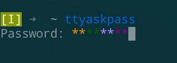

ttyaskpass
==========



a safely passphrase prompt library and application,
support [Chroma-Hash](https://github.com/mattt/Chroma-Hash/)-like colorhash,
use [seckey](https://github.com/quininer/seckey) protecte password.

usage
-----

library:

```
extern crate ttyaskpass;
use ttyaskpass::askpass;

fn main() {
	let pass = askpass::<Vec<u8>>("Password:", '*').unwrap();
	println!("Your password is {}", String::from_utf8(pass).unwrap());
}
```

see [examples/readme.rs](examples/readme.rs) and [ttyaskpass.rs](src/bin/ttyaskpass.rs).


application:

```
env SSH_ASKPASS=ttyaskpass ssh-add </dev/null
```
